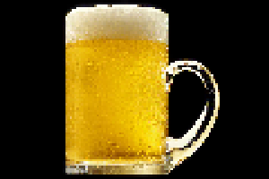

# digitoelfika

Everything about the digitölfika.

 * URL: https://uu-se.zoom.us/j/7093465705
 * Passcode: beer (the Dutch word for a bear)
 * When: every odd week
 * Time: Fridays 17:00

## Future meetings
 
 * Friday May 14th 2021 17:00
 * Friday May 28th 2021 17:00
 * Friday June 11th 2021 17:00
 * Friday June 25th 2021 17:00
 * Friday July 9th 2021 17:00
 * Friday July 23rd 2021 17:00

## Past meetings

 * Thursday April 29th 2021 16:00: first digitölfika on Zoom

## FAQ

### Am I welcome as a student/PhD/postdoc/professor?

Yes.

### I cannot be there at Digitölfika

Life can indeed be unfair like that.

Maybe [this beer simulator](https://github.com/richelbilderbeek/beer_sim)
can compensate a bit.

## Image source

 * [beer.jpg](https://commons.wikimedia.org/wiki/File:NCI_Visuals_Food_Beer.jpg)
