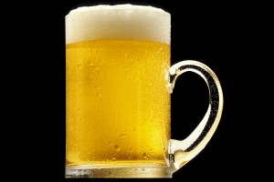

# Ölfika

Everything about the ölfika.

 * When: every odd week
 * Time: Fridays 16:00

## Future meetings

 * Friday October 15th 2021 16:00 at Navet at BMC :tropical_drink:

## Past meetings

 * Friday October 1st 2021 16:00 at Navet at BMC :tropical_drink:
 * Friday September 17th 2021 17:00 :computer:
 * Friday September 3rd 2021 17:00 :computer:
 * Friday August 20th 2021 17:00 :computer:
 * Friday August 6th 2021 17:00 :computer:
 * Friday July 23rd 2021 17:00 :computer:
 * Friday July 9th 2021 17:00 :computer:
 * Friday June 25th 2021 17:00 :computer:
 * Friday June 11th 2021 17:00 :computer:
 * Friday May 28th 2021 17:00 :computer:
 * Friday May 14th 2021 17:00 :computer:
 * Thursday April 29th 2021 16:00: first digitölfika on Zoom :computer:

## FAQ

### Am I welcome as a student/PhD/postdoc/professor?

Yes.

### What is the Ölfika?

A social and informal event with beer ('öl' is Swedish for beer)
in real life.

### What is the Digitölfika?

A social and informal event with beer ('öl' is Swedish for beer)
online on Zoom. 

### I cannot be there at Ölfika/Digitölfika

Life can indeed be unfair like that.

Maybe [this beer simulator](https://github.com/richelbilderbeek/beer_sim)
can compensate a bit.

### Where is the Digitölfika?

 * URL: https://uu-se.zoom.us/j/7093465705
 * Passcode: beer (the Dutch word for a bear)

## Image source

 * [beer.jpg](https://commons.wikimedia.org/wiki/File:NCI_Visuals_Food_Beer.jpg)
